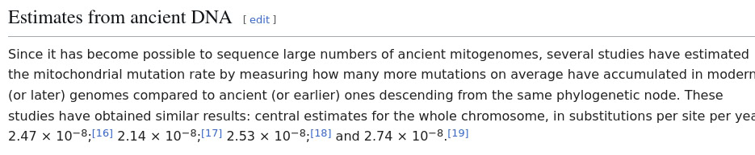

```{r setup, include=FALSE}
knitr::opts_chunk$set(echo = TRUE)
```

# Task

Get data from the resource, make a phylogenetic tree and answer some questions about how human have populated the world

# Script

## Setup

Attach libs
```{r libs, echo = F}
libs = c("tidyverse", "ggtree", "ggnewscale",  "ape", "seqinr", "treeio")

for (lib in libs){
  if(!require(lib, character.only = T)) install.packages(lib)
  library(lib, character.only = T, verbose = F)
}
```

Create env, download scripts and programms:

```{r conda, engine='bash', eval = F}
conda create --name hw1_phylo
conda activate hw1_phylo

conda install bioconda::mafft
conda install bioconda::iqtree
```

## Get data

```{r download, engine='bash', echo = F, eval = F}
wget --content-disposition https://figshare.com/ndownloader/files/30768763 
wget --content-disposition https://figshare.com/ndownloader/files/30768766
wget --content-disposition https://figshare.com/ndownloader/files/30768775
wget --content-disposition https://figshare.com/ndownloader/files/30768769

for i in $(ls *zip); do unzip $i; done
rm -r __*
rm *.zip
```

## MAFFT

Make alignment files:

-   across human `human.fa`

-   across different *Homo* species `homo.fa`

-   with added outgroup for *Homo* `full.fa`

```{r mafft, engine = "bash", eval = FALSE}
cat Human/* >> raw.fa  
mafft raw.fa > human.fa

cat Neanderthal/* >> raw.fa
cat Denisova/* >> raw.fa
mafft raw.fa > homo.fa

cat Pan/* >> raw.fa
mafft raw.fa > full.fa
```

## Phylogeny

I select `iqtree` for tree reconstruction - for simplicity

### Human
```{bash human_phylo, eval = F}
mkdir -p iqtree/human

iqtree -s human.fa \
  -m MFP -B 1000 -safe
  
mv human.fa.* iqtree/human/
```

### Homo

Get outgroups:
```{bash homo_out}
grep ">" Denisova/* >> out1
grep ">" Neanderthal/* >> out1

out1=$(cat out1 | sed 's/.*:>//g' | sed 's/ .*//g' | tr '\n' ',' | head -c -1)
```


Reconstruct:
```{bash homo_phylo, eval = F}
mkdir -p iqtree/homo

iqtree -s homo.fa \
  -o $out1 \
  -m MFP -B 1000 -safe
  
mv homo.fa.* iqtree/homo/
```


### Full

Get outgroups:
```{bash full_out}
grep ">" Pan/* >> out2

out2=$(cat out2 | sed 's/.*:>//g' | sed 's/ .*//g' | tr '\n' ',' | head -c -1)
```


Reconstruct:
```{bash full_phylo, eval = F}
mkdir -p iqtree/full

iqtree -s full.fa \
  -o $out2 \
  -m MFP -B 1000 -safe
  
mv full.fa.* iqtree/full
```

## Analysis

### IQ-TREE model finder
```{r models, engine='bash'}
for dir in $(ls iqtree); do
  echo $dir
  gzip -d iqtree/$dir/*model.gz
  grep "best_model" iqtree/$dir/*model
  gzip iqtree/$dir/*model
  echo -e "#####\n"
done
```

Without outgroups, according to AIC GTR is better then TIM2, in other cases TIM2 were selected. It is normal for mitochondrial DNA

### Tree vizualizations

Read headers of files and compile the legend:

```{r legend_make, engine = 'bash'}
grep ">" full.fa > legend
```

```{r legend_compile}
legend <- readLines("legend")
legend <- data.frame(
  
  label = legend %>% 
    str_remove_all(">") %>% 
    str_remove_all(" .*"),
  
  haplo = legend %>% 
    str_extract("(?<=haplogroup )[^ ]*"),
  
  color = legend %>% 
    str_extract("(?<=haplogroup )[^ ]"),
  
  sp = legend %>% 
    str_extract(">[^ ]* [^ ]* [^ ]* [^ ]* [^ ]*") %>% 
    str_remove_all(">[^ ]* ") %>% 
    str_remove("Homo [^ ]* ") %>% 
    str_remove(" isolate") %>% 
    str_remove("ssp. ") %>% 
    str_remove(" mitoch.*") %>% 
    str_remove(" complete") %>% 
    str_replace("Altai", "Denisova")
) %>% 
  mutate(clear = ifelse(
    is.na(haplo),
    sp,
    haplo
  ))

legend %>% tibble
```

Read .contree:

```{r input_tree}
rt <- function(fname){
  nm <- paste0("iqtree/", fname, "/", fname, ".fa.contree")
  
  tmp <- read.tree(nm)
  legend_tmp <- legend %>% 
    subset(label %in% tmp$tip.label)
  tmp <- ggtree(tmp)$data %>%
    full_join(legend, by= "label")
  
  return(tmp)
}

full <- rt("full")
homo <- rt("homo")
human <- rt("human")
```

Viz:
```{r tree1, echo = F, out.height=800, out.width=1200}
ggt <- function(inp){
  
  inp$label[inp$label == ""] <- 0
  
  ggtree(inp,
         aes(color = as.numeric(label))
         #, layout="circular"
         ) +
    scale_color_gradient(name = "bootstrap", low = "lightgreen", high = "darkgreen", na.value = "darkgreen") +
    ggnewscale::new_scale_color() +
    geom_tiplab(aes(color = color, label = clear), show.legend = F) +
    theme(legend.position = "bottom")
    
}

ggt(full) 
ggt(homo)
ggt(human)
```


### Tree comparison
Let's compare tree topology
```{r tree_comp, echo = F, out.height = 800, out.width = 2000, fig.cap = "Phylogeny"}
ggcompare <- function(d1, d2, d3) {
  mms <- function(x) (x - min(x, na.rm = T)) / 
    (max(x, na.rm = T)-min(x, na.rm = T))
  
  # main code from https://yulab-smu.top/treedata-book/chapter2.html
  d1$x <- mms(d1$x)
  d2$x <- mms(d2$x) + max(d1$x, na.rm = T) + .3
  d3$x <- mms(d3$x) + max(d2$x, na.rm = T) + .3
  
  dd = bind_rows(d1, d2, d3) %>% 
    filter(!is.na(label)) %>% 
    subset(isTip)
  
  ggtree(d1, aes(color = label %>% as.numeric())) + 
    geom_tree(data = d2, aes(color = label%>% as.numeric())) + 
    geom_tree(data = d3, aes(color = label%>% as.numeric())) + 
    
    scale_color_gradient(name = "bootstrap", low = "lightgreen", high = "darkgreen", na.value = "darkgreen") +
    
    ggnewscale::new_scale_color() +
    geom_tiplab(data = d3, aes(label = clear, color = color), show.legend = F) + 
    geom_line(aes(x, y, group=label, color = color), data=dd, alpha=.3, show.legend = F) +
    theme(legend.position = "bottom")
}

ggcompare(
  human,
  homo,
  full
)
```

A little differences between trees of homo and all humans, but only at *polytomy* point with low branch support

### Molecular clocks

To add molecular clock to data, I try to perform two adjustments:

- evaluating mutation rate + use mithochondrial molecular clock

- add paleonthological data (for trees 2 and 3)

#### Mutation rate

Read data

```{r MR_read, echo = F}
fa <- seqinr::read.fasta("human.fa")
```

Get most distant sequences:

```{r most_distant}
mt <- human %>% 
  as.phylo %>% 
  cophenetic.phylo %>% 
  as.matrix

top <- mt %>% unlist %>% sort(decreasing = T)
cat("Jackknife for top 25: ", top[50] %>% round(5))

ggplot(data.frame(x = top), mapping = aes(x)) + 
  geom_density() + 
  geom_jitter(aes(y = -100), height = 100, width = 0) +
  theme_minimal() +
  xlab("Distance")
```


```{r most_distant2}
res <- tibble()
for (i in 1:nrow(mt)) for(j in i:ncol(mt)){
  if (mt[i,j] >= top[50]) {
    tmp <- data.frame(s1 = rownames(mt)[i], 
                      s2 = colnames(mt)[j])
    res <- rbind(res, tmp)
  }
}

print(res)
```

Calculate mutation rate:
```{r MR_calc}
mr <- c()
for (i in 1:nrow(res)) {
  s1 <- fa[[res[i,1]]]
  s2 <- fa[[res[i,2]]]
  
  mismatch = 0
  for (j in 1:length(s1)){
    if((s1[j] != s2[j]) & 
       # only SNP
       !(s1[j] %in% c("N", "n", "-")) & 
       !(s2[j] %in% c("N", "n", "-"))) {
      mismatch = mismatch + 1
    }
  }
  
  mr <- c(mr, mismatch)
}

ggplot(data.frame(x = mr), mapping = aes(x)) + 
  geom_density() + 
  geom_jitter(aes(y = 0), height = .01, width = 0) +
  theme_minimal() +
  xlab("Mutations")
```

So, overall there are >90 mutations between most distant groups (maximum 96), and even for related groups we have similar number of mutations 

I possibly can apply some big math and calculate the number of mutation differences in mtDNA that at least two people have using mathematical expectation on normal distributed value, but it should not work in this case, and some skylines should be better for this problem, so let's use it as it is

Mutation rate was obtained from english wiki (i trust it):


Estimate:
```{r calibrate}
MRs = c(2.14, 2.47, 2.53, 2.74) * 10^(-8) * length(fa[[1]])

data <- tibble()
for (i in MRs) {
  data <- rbind(data, 
                data.frame(MR = mr/i, type = i))
}

ggplot(data, mapping = aes(MR)) + 
  geom_density() + 
  geom_jitter(aes(y = 0, color = type), height = 10^(-6), width = 0) +
  theme_minimal() +
  xlab("Time to EVE")
```

So, using this method actual estimated time is 180-270 thousands of years to LCA (mt EVE). Calibrating it to the distance, we have:

```{r mtEVE_dist}
data <- data %>% 
  mutate(dist = rep(top[1:25],4)) %>% 
  mutate(tp = type * 1000) %>% 
  mutate(tp = paste0(round(tp,2), " mut. per 1000 year"))

ggplot(data, aes(MR/1000, dist, color = type, group = type)) +
  geom_point() +
  geom_smooth(method = "lm", formula = 'y~x') +
  facet_wrap(~tp, scales = "free") +
  xlab("thousands years to mtEVE") + ylab("cophenetic distance")+
  theme_minimal()
```

So average clock is ~ 34146.34 thousands of years per 1 value of cophenetic distance (*for humans*). Let's calibrate using this info other trees:

```{r maximum_cophenetic}
human_calibr = 210/0.00615

human_coph <- function(ph) {
  lbs <- human$label[human$isTip]
   tmp <- ph %>% 
      as.phylo %>% 
      cophenetic.phylo %>% 
      as.data.frame() %>% 
      #subset by human labels
      subset(rownames(.) %in% lbs) %>% t %>% 
      subset(rownames(.) %in% lbs) %>% 
      unlist %>% 
      sort(decreasing = T)
   
   
   gg <- data.frame(t1 = tmp[1:25],
              t2 = top[1:25]) %>% 
    ggplot(aes(t1, t2)) +
    geom_point() +
    geom_smooth(method = "lm", formula = 'y~x') +
    xlab("CD estimated") + ylab("CD human")+
    theme_minimal()
   
   print(gg)
   
   CD = mean(tmp[1:25]/top[1:25])
   MR = human_calibr / CD
   
   return(MR)
}

full_calibr <- human_coph(full)
homo_calibr <- human_coph(homo)
```

Rates are pretty similar

#### Paleo data
That is estimated that CHLCA have lived ~ 6 mln years ago. So we can compare mtEVE rate on the full tree with this estimation:

```{r}
CHLCA_dist <- full %>% 
  as.phylo %>% 
  cophenetic %>% 
  max

CHLCA_calibr <- 6000/CHLCA_dist

cat(
  " mtEVE calibr:", full_calibr, "1000 years / distance value\n",
  "Paleo calibr:", CHLCA_calibr, "1000 years / distance value"
)
```

Not that bad! Difference < 15% between estimations and paleonthology, which is obviously very good for this scenario. So we can finally add molecular clocks to the trees:

```{r tree2, out.height = 800, out.width = 1200, fig.cap = "Phylogeny"}
ggt <- function(inp, calibr){
  
  inp$label[inp$label == ""] <- 0
  inp$branch.length <- inp$branch.length * calibr
  inp$x <- inp$x * calibr
  
  gg <- ggtree(inp,
         aes(color = as.numeric(label))
         #, layout="circular"
         ) +
    scale_color_gradient(name = "bootstrap", low = "lightgreen", high = "darkgreen", na.value = "darkgreen") +
    ggnewscale::new_scale_color() +
    geom_tiplab(aes(color = color, label = clear), show.legend = F) +
    theme_tree2()  + 
    theme(legend.position = "bottom") +
    xlab("thousands of years")
  
  revts(gg) +
    scale_x_continuous(labels = abs)
    
}

ggt(full, full_calibr) 
ggt(homo, homo_calibr)
ggt(human, human_calibr)
```

Pretty good results, with good connection to known data!